# Network-Aware Hybrid GNN Architecture
## Based on Actual Implementation in `scripts/analyze_and_train_network_aware.py`

This document describes the **exact architecture** as implemented in the codebase.

## 📊 Model Configuration

```python
HIDDEN_DIM = 256
NUM_HEADS = 8
DROPOUT = 0.4
LEARNING_RATE = 0.0005
BATCH_SIZE = 128
NUM_EPOCHS = 100
```

## 🏗️ Complete Architecture Diagram

```mermaid
graph TB
    subgraph Input["📥 INPUT LAYER"]
        A[Current Attack ID<br/>e.g., T1566 → idx]
        B[Network Features<br/>18D Vector<br/>normalized]
        C[Graph Structure<br/>edge_index: 2×E<br/>edge_attr: E×6]
    end
    
    subgraph GNN["🔵 GNN PATH - Graph Attention Network"]
        D[Node Embedding<br/>num_techniques → 256D<br/>Learnable]
        E[GAT Layer 1<br/>256D → 8×32D → 256D<br/>8 heads, edge_dim=6]
        F[ReLU + Dropout 0.3]
        G[GAT Layer 2<br/>256D → 8×32D → 256D<br/>8 heads, edge_dim=6]
        H[ReLU + Dropout 0.3]
        I[GAT Layer 3<br/>256D → 1×256D → 256D<br/>1 head, edge_dim=6]
        J[Extract Current Node<br/>node_emb = x[current_ids]]
    end
    
    subgraph Network["🟢 NETWORK PATH - MLP Encoder"]
        K[Linear 1<br/>18D → 256D]
        L[BatchNorm1D]
        M[ReLU]
        N[Dropout 0.4]
        O[Linear 2<br/>256D → 256D]
        P[BatchNorm1D]
        Q[ReLU]
    end
    
    subgraph Fusion["🟡 FUSION & CLASSIFICATION"]
        R[Concatenate<br/>node_emb + net_emb<br/>256D + 256D = 512D]
        S[Linear<br/>512D → 256D]
        T[BatchNorm1D]
        U[ReLU]
        V[Dropout 0.4]
        W[Classifier<br/>256D → num_techniques]
        X[Output Logits<br/>Apply softmax for probabilities]
    end
    
    A --> D
    D --> E
    C -.->|Edge Features 6D| E
    E --> F
    F --> G
    C -.->|Edge Features 6D| G
    G --> H
    H --> I
    C -.->|Edge Features 6D| I
    I --> J
    
    B --> K
    K --> L
    L --> M
    M --> N
    N --> O
    O --> P
    P --> Q
    
    J --> R
    Q --> R
    R --> S
    S --> T
    T --> U
    U --> V
    V --> W
    W --> X
    
    style GNN fill:#6B9BD1,stroke:#2E5C8A,stroke-width:3px,color:#fff
    style Network fill:#7BC96F,stroke:#4A7C59,stroke-width:3px,color:#fff
    style Fusion fill:#F4D03F,stroke:#C29D0B,stroke-width:3px,color:#000
    style Input fill:#E8E8E8,stroke:#666,stroke-width:2px
```

## 🔍 Detailed Component Breakdown

### 1. Input Layer

```mermaid
graph LR
    subgraph Inputs
        A[Current Attack ID<br/>Integer: 0 to num_techniques-1]
        B[Network Features<br/>18D Float Vector<br/>Z-score normalized]
        C[Graph Structure<br/>edge_index: [2, num_edges]<br/>edge_attr: [num_edges, 6]]
    end
    
    A --> D[To Node Embedding]
    B --> E[To Network Encoder]
    C --> F[To GAT Layers]
    
    style A fill:#FFE5E5
    style B fill:#E5FFE5
    style C fill:#E5E5FF
```

**Input Specifications:**
- **Current Attack ID**: Integer index (0 to num_techniques-1)
- **Network Features**: 18-dimensional vector
  ```python
  [
      packet_count,      # [0]
      byte_count,        # [1]
      avg_packet_size,   # [2]
      packet_rate,       # [3]
      byte_rate,         # [4]
      flow_count,        # [5]
      tcp_ratio,         # [6]
      udp_ratio,         # [7]
      icmp_ratio,        # [8]
      ...                # [9-17] Additional features
  ]
  ```
  - Normalized: `(x - mean) / std`
  
- **Graph Structure**:
  - `edge_index`: [2, num_edges] - Source and target node indices
  - `edge_attr`: [num_edges, 6] - 6D edge features (see below)

### 2. Edge Features (6D)


**Example Edge:**
```python
# T1566 (Phishing) → T1059 (Command Execution)
# Raw features before normalization:
edge_feature = [
    0.0045,    # [0] 450 occurrences / 100,000 total = 0.45%
    250.0,     # [1] Average 250 packets
    80.0,      # [2] Std dev 80 packets
    75000.0,   # [3] Average 75KB
    25000.0,   # [4] Std dev 25KB
    6.11       # [5] log1p(450) = 6.11
]
# Then normalized: (edge_feature - mean) / std
```

### 3. GNN Path - Graph Attention Network

```mermaid
graph TB
    subgraph Embedding["Node Embedding Layer"]
        A[Embedding Table<br/>Shape: num_techniques × 256<br/>Learnable Parameters]
        B[All Node Embeddings<br/>x = self.node_embedding.weight]
    end
    
    subgraph GAT1["GAT Layer 1"]
        C[Input: 256D]
        D[Multi-Head Attention<br/>8 heads × 32D each]
        E[Edge Features: 6D<br/>Used in attention computation]
        F[Output: 8 × 32D = 256D<br/>Concatenated]
        G[ReLU Activation]
        H[Dropout 0.3]
    end
    
    subgraph GAT2["GAT Layer 2"]
        I[Input: 256D]
        J[Multi-Head Attention<br/>8 heads × 32D each]
        K[Edge Features: 6D<br/>Used in attention computation]
        L[Output: 8 × 32D = 256D<br/>Concatenated]
        M[ReLU Activation]
        N[Dropout 0.3]
    end
    
    subgraph GAT3["GAT Layer 3"]
        O[Input: 256D]
        P[Single-Head Attention<br/>1 head × 256D]
        Q[Edge Features: 6D<br/>Used in attention computation]
        R[Output: 256D<br/>No activation]
    end
    
    subgraph Selection["Node Selection"]
        S[Extract Current Node Embeddings<br/>node_emb = x[current_node_ids]]
    end
    
    A --> B
    B --> C
    C --> D
    E --> D
    D --> F
    F --> G
    G --> H
    
    H --> I
    I --> J
    K --> J
    J --> L
    L --> M
    M --> N
    
    N --> O
    O --> P
    Q --> P
    P --> R
    
    R --> S
    
    style Embedding fill:#D6EAF8
    style GAT1 fill:#AED6F1
    style GAT2 fill:#85C1E2
    style GAT3 fill:#5DADE2
    style Selection fill:#3498DB
```

**GAT Layer Implementation:**
```python
# GAT Layer 1
self.gat1 = GATConv(
    in_channels=256,           # Input dimension
    out_channels=32,           # Output per head
    heads=8,                   # Number of attention heads
    edge_dim=6,                # Edge feature dimension
    dropout=0.4                # Dropout rate
)

# Forward pass
x = F.relu(self.gat1(x, edge_index, edge_attr))
x = F.dropout(x, p=0.3, training=self.training)
```

**Attention Mechanism:**


**Attention Formula:**
```
α_ij = softmax_j(LeakyReLU(a^T [W_node·h_i || W_node·h_j || W_edge·e_ij]))
h_i' = Σ_j α_ij · W_value · h_j
```

### 4. Network Path - MLP Encoder

```mermaid
graph TB
    subgraph Input["Input"]
        A[Network Features<br/>18D Vector<br/>Normalized]
    end
    
    subgraph Layer1["Encoder Layer 1"]
        B[Linear<br/>18D → 256D<br/>Weight: 18×256]
        C[BatchNorm1D<br/>Normalize across batch]
        D[ReLU<br/>Activation]
        E[Dropout 0.4<br/>Regularization]
    end
    
    subgraph Layer2["Encoder Layer 2"]
        F[Linear<br/>256D → 256D<br/>Weight: 256×256]
        G[BatchNorm1D<br/>Normalize across batch]
        H[ReLU<br/>Activation]
    end
    
    subgraph Output["Output"]
        I[Network Embedding<br/>256D Vector<br/>net_emb]
    end
    
    A --> B
    B --> C
    C --> D
    D --> E
    E --> F
    F --> G
    G --> H
    H --> I
    
    style Input fill:#E5FFE5
    style Layer1 fill:#A9DFBF
    style Layer2 fill:#7DCEA0
    style Output fill:#52BE80
```



**Implementation:**
```python
self.network_encoder = nn.Sequential(
    nn.Linear(18, 256),        # Layer 1
    nn.BatchNorm1d(256),
    nn.ReLU(),
    nn.Dropout(0.4),
    nn.Linear(256, 256),       # Layer 2
    nn.BatchNorm1d(256),
    nn.ReLU()
)

# Forward pass
net_emb = self.network_encoder(network_features)
```

### 5. Fusion & Classification


**Implementation:**
```python
# Fusion
self.fusion = nn.Sequential(
    nn.Linear(512, 256),
    nn.BatchNorm1d(256),
    nn.ReLU(),
    nn.Dropout(0.4)
)

# Classifier
self.classifier = nn.Linear(256, num_techniques)

# Forward pass
combined = torch.cat([node_emb, net_emb], dim=1)  # 512D
fused = self.fusion(combined)                      # 256D
logits = self.classifier(fused)                    # num_techniques
```

## 🔄 Complete Forward Pass


## 📊 Model Statistics

### Parameter Count

```python
# Approximate parameter counts:
Node Embeddings:     num_techniques × 256        ≈ 500K
GAT Layer 1:         256 × 32 × 8 + edge params  ≈ 200K
GAT Layer 2:         256 × 32 × 8 + edge params  ≈ 200K
GAT Layer 3:         256 × 256 + edge params     ≈ 150K
Network Encoder:     (18×256) + (256×256)        ≈ 70K
Fusion Layer:        512 × 256                   ≈ 130K
Classifier:          256 × num_techniques        ≈ 500K

Total:                                           ≈ 1.75M parameters
```

### Computational Complexity


## 🎯 Key Features

### 1. Network-Aware Edges

**Traditional GAT:**
```python
# Edge weight = scalar (transition frequency)
edge_weight = count(A→B) / total_from_A
```

**Network-Aware GAT:**
```python
# Edge features = 6D vector (frequency + network stats)
edge_features = [
    transition_prob,
    avg_packets,
    std_packets,
    avg_bytes,
    std_bytes,
    log_count
]
```

### 2. Dual-Path Architecture


**Why Dual-Path?**
- **GNN Path**: Captures attack sequence patterns from graph structure
- **Network Path**: Captures network behavior from traffic features
- **Fusion**: Combines both for robust predictions

### 3. Multi-Head Attention

```mermaid
graph TB
    subgraph Input["Input: 256D"]
        A[Node Features]
    end
    
    subgraph Heads["8 Attention Heads"]
        B1[Head 1: 32D]
        B2[Head 2: 32D]
        B3[Head 3: 32D]
        B4[Head 4: 32D]
        B5[Head 5: 32D]
        B6[Head 6: 32D]
        B7[Head 7: 32D]
        B8[Head 8: 32D]
    end
    
    subgraph Output["Output: 256D"]
        C[Concatenate<br/>8 × 32D = 256D]
    end
    
    A --> B1 & B2 & B3 & B4 & B5 & B6 & B7 & B8
    B1 & B2 & B3 & B4 & B5 & B6 & B7 & B8 --> C
    
    style Input fill:#E8E8E8
    style Heads fill:#AED6F1
    style Output fill:#5DADE2
```



**Benefits:**
- Each head learns different attention patterns
- Captures multiple types of relationships
- More robust representations

## 🔬 Training Process


## 📈 Model Performance

### Expected Metrics

```python
# Typical results on test set:
Top-1 Accuracy: 55-65%
Top-3 Accuracy: 70-80%
Top-5 Accuracy: 80-90%

# Training time (GPU):
~20 minutes for 100 epochs

# Inference time:
~2ms per sample
```

### Data Split


## 🎓 Summary

The Network-Aware Hybrid GNN combines:

1. **Graph Attention Networks** (3 layers)
   - Multi-head attention (8 heads in layers 1-2, 1 head in layer 3)
   - Edge-aware attention using 6D edge features
   - Captures attack sequence patterns

2. **MLP Network Encoder** (2 layers)
   - Processes 18D network features
   - Batch normalization for stability
   - Captures network behavior patterns

3. **Fusion Layer**
   - Concatenates GNN and network embeddings (512D)
   - Reduces to 256D with batch norm and dropout
   - Combines complementary information

4. **Classifier**
   - Linear layer to num_techniques outputs
   - Produces logits for next attack prediction

**Total Parameters**: ~1.75M
**Training Time**: ~20 minutes (100 epochs, GPU)
**Inference Time**: ~2ms per sample

---

**Implementation**: `scripts/analyze_and_train_network_aware.py`
**Model Class**: `NetworkAwareHybridGNN`
