# Network-Aware Hybrid GNN Architecture

## 🏗️ Complete Model Architecture

### High-Level Overview

```mermaid
graph TB
    subgraph Input["📥 INPUT LAYER"]
        A[Current Attack ID<br/>Integer Index]
        B[Network Features<br/>18D Vector]
        C[Graph Structure<br/>Edge Index + Edge Attr]
    end
    
    subgraph GNN["🔵 GNN PATH - Graph Structure Learning"]
        D[Node Embedding Layer<br/>num_techniques → 256D]
        E[GAT Layer 1<br/>8 heads × 32D = 256D<br/>Edge-aware attention]
        F[ReLU + Dropout 0.3]
        G[GAT Layer 2<br/>8 heads × 32D = 256D<br/>Edge-aware attention]
        H[ReLU + Dropout 0.3]
        I[GAT Layer 3<br/>1 head × 256D<br/>Edge-aware attention]
        J[Node Selection<br/>Extract current node embedding]
    end
    
    subgraph Network["🟢 NETWORK PATH - Temporal Features"]
        K[Linear Layer 1<br/>18D → 256D]
        L[BatchNorm1D]
        M[ReLU]
        N[Dropout 0.4]
        O[Linear Layer 2<br/>256D → 256D]
        P[BatchNorm1D]
        Q[ReLU]
    end
    
    subgraph Fusion["🟡 FUSION & CLASSIFICATION"]
        R[Concatenation<br/>256D + 256D = 512D]
        S[Linear Layer<br/>512D → 256D]
        T[BatchNorm1D]
        U[ReLU]
        V[Dropout 0.4]
        W[Classifier<br/>256D → num_techniques]
        X[Softmax<br/>Probability Distribution]
    end
    
    subgraph Output["📤 OUTPUT"]
        Y[Next Attack Predictions<br/>Top-K Probabilities]
    end
    
    A --> D
    D --> E
    C -.->|Edge Features 6D| E
    E --> F
    F --> G
    C -.->|Edge Features 6D| G
    G --> H
    H --> I
    C -.->|Edge Features 6D| I
    I --> J
    
    B --> K
    K --> L
    L --> M
    M --> N
    N --> O
    O --> P
    P --> Q
    
    J --> R
    Q --> R
    R --> S
    S --> T
    T --> U
    U --> V
    V --> W
    W --> X
    X --> Y
    
    style GNN fill:#6B9BD1,stroke:#2E5C8A,stroke-width:3px,color:#fff
    style Network fill:#7BC96F,stroke:#4A7C59,stroke-width:3px,color:#fff
    style Fusion fill:#F4D03F,stroke:#C29D0B,stroke-width:3px,color:#000
    style Input fill:#E8E8E8,stroke:#666,stroke-width:2px
    style Output fill:#E8E8E8,stroke:#666,stroke-width:2px
```



## 🔍 Detailed Component Breakdown

### 1. Input Layer

```mermaid
graph LR
    subgraph Inputs
        A[Current Attack ID<br/>e.g., T1566 → idx=42]
        B[Network Features 18D<br/>packets, bytes, protocols, etc.]
        C[Graph Structure<br/>edge_index: 2×E<br/>edge_attr: E×6]
    end
    
    A --> D[To GNN Path]
    B --> E[To Network Path]
    C --> F[To GAT Layers]
    
    style A fill:#FFE5E5
    style B fill:#E5FFE5
    style C fill:#E5E5FF
```



**Input Specifications:**
- **Current Attack ID**: Integer index (0 to num_techniques-1)
- **Network Features**: 18-dimensional vector
  - Packet count, byte count, flow statistics
  - Protocol distributions, timing features
  - Normalized using z-score
- **Graph Structure**:
  - `edge_index`: [2, num_edges] - Source and target nodes
  - `edge_attr`: [num_edges, 6] - Edge features (see below)

### 2. GNN Path - Graph Attention Network

```mermaid
graph TB
    subgraph Embedding["Node Embedding"]
        A[Embedding Table<br/>num_techniques × 256D<br/>Learnable parameters]
    end
    
    subgraph GAT1["GAT Layer 1"]
        B[Multi-Head Attention<br/>8 heads]
        C[Edge Feature Integration<br/>6D edge features]
        D[Message Passing<br/>Aggregate from neighbors]
        E[Concatenate Heads<br/>8 × 32D = 256D]
    end
    
    subgraph GAT2["GAT Layer 2"]
        F[Multi-Head Attention<br/>8 heads]
        G[Edge Feature Integration<br/>6D edge features]
        H[Message Passing<br/>Aggregate from neighbors]
        I[Concatenate Heads<br/>8 × 32D = 256D]
    end
    
    subgraph GAT3["GAT Layer 3"]
        J[Single-Head Attention<br/>1 head]
        K[Edge Feature Integration<br/>6D edge features]
        L[Message Passing<br/>Aggregate from neighbors]
        M[Output 256D]
    end
    
    A --> B
    C --> D
    B --> D
    D --> E
    E -->|ReLU + Dropout| F
    G --> H
    F --> H
    H --> I
    I -->|ReLU + Dropout| J
    K --> L
    J --> L
    L --> M
    
    style Embedding fill:#D6EAF8
    style GAT1 fill:#AED6F1
    style GAT2 fill:#85C1E2
    style GAT3 fill:#5DADE2
```



**GAT Layer Details:**

#### Attention Mechanism


**Attention Formula:**
```
α_ij = softmax(LeakyReLU(W_node @ [h_i || h_j] + W_edge @ e_ij))
h_i' = Σ_j α_ij * W_value @ h_j
```

### 3. Edge Features (6D)

```mermaid
graph TB
    subgraph EdgeFeatures["Edge Feature Vector 6D"]
        A[Feature 0<br/>Transition Probability<br/>P next|current]
        B[Feature 1<br/>Avg Packet Count<br/>Mean packets for transition]
        C[Feature 2<br/>Std Packet Count<br/>Variance in packets]
        D[Feature 3<br/>Avg Byte Count<br/>Mean bytes for transition]
        E[Feature 4<br/>Std Byte Count<br/>Variance in bytes]
        F[Feature 5<br/>Log Transition Count<br/>log1 + count]
    end
    
    A --> G[Normalized<br/>Z-score]
    B --> G
    C --> G
    D --> G
    E --> G
    F --> G
    
    G --> H[Used in GAT<br/>Attention Computation]
    
    style A fill:#FFE5E5
    style B fill:#FFE5E5
    style C fill:#FFE5E5
    style D fill:#E5FFE5
    style E fill:#E5FFE5
    style F fill:#E5E5FF
```

**Example Edge:**
```
T1566 (Phishing) → T1059 (Command Execution)
Edge Features: [0.45, 250.0, 80.0, 75000.0, 25000.0, 4.5]
```

### 4. Network Path - MLP Encoder

```mermaid
graph TB
    subgraph Input["Input"]
        A[Network Features<br/>18D Vector]
    end
    
    subgraph Layer1["Encoder Layer 1"]
        B[Linear<br/>18D → 256D]
        C[BatchNorm1D]
        D[ReLU]
        E[Dropout 0.4]
    end
    
    subgraph Layer2["Encoder Layer 2"]
        F[Linear<br/>256D → 256D]
        G[BatchNorm1D]
        H[ReLU]
    end
    
    subgraph Output["Output"]
        I[Network Embedding<br/>256D]
    end
    
    A --> B
    B --> C
    C --> D
    D --> E
    E --> F
    F --> G
    G --> H
    H --> I
    
    style Input fill:#E5FFE5
    style Layer1 fill:#A9DFBF
    style Layer2 fill:#7DCEA0
    style Output fill:#52BE80
```



**Network Features (18D):**
1. Packet count (3s window)
2. Byte count (3s window)
3. Average packet size
4. Packet rate
5. Byte rate
6. Flow count
7-12. Protocol distribution (TCP, UDP, ICMP, etc.)
13-18. Timing features (inter-arrival times, etc.)

### 5. Fusion & Classification

```mermaid
graph TB
    subgraph Inputs["Inputs"]
        A[GNN Embedding<br/>256D]
        B[Network Embedding<br/>256D]
    end
    
    subgraph Concat["Concatenation"]
        C[Concatenate<br/>512D]
    end
    
    subgraph Fusion["Fusion Layer"]
        D[Linear<br/>512D → 256D]
        E[BatchNorm1D]
        F[ReLU]
        G[Dropout 0.4]
    end
    
    subgraph Classification["Classification"]
        H[Linear<br/>256D → num_techniques]
        I[Softmax]
    end
    
    subgraph Output["Output"]
        J[Probability Distribution<br/>P next_attack | current, network]
    end
    
    A --> C
    B --> C
    C --> D
    D --> E
    E --> F
    F --> G
    G --> H
    H --> I
    I --> J
    
    style Inputs fill:#E8E8E8
    style Concat fill:#F9E79F
    style Fusion fill:#F7DC6F
    style Classification fill:#F4D03F
    style Output fill:#F1C40F
```

## 🔄 Complete Forward Pass


## 📊 Model Statistics

### Parameter Count


**Approximate Parameter Counts:**
- Node Embeddings: ~500K parameters
- GAT Layers: ~700K parameters
- Network Encoder: ~300K parameters
- Fusion Layer: ~300K parameters
- Classifier: ~200K parameters
- **Total: ~2M parameters**

### Computational Flow


## 🎯 Key Features

### 1. Multi-Head Attention

```mermaid
graph TB
    subgraph Input["Input Node Features"]
        A[Node Embedding<br/>256D]
    end
    
    subgraph Heads["8 Attention Heads"]
        B1[Head 1<br/>32D]
        B2[Head 2<br/>32D]
        B3[Head 3<br/>32D]
        B4[Head 4<br/>32D]
        B5[Head 5<br/>32D]
        B6[Head 6<br/>32D]
        B7[Head 7<br/>32D]
        B8[Head 8<br/>32D]
    end
    
    subgraph Output["Output"]
        C[Concatenate<br/>8 × 32D = 256D]
    end
    
    A --> B1
    A --> B2
    A --> B3
    A --> B4
    A --> B5
    A --> B6
    A --> B7
    A --> B8
    
    B1 --> C
    B2 --> C
    B3 --> C
    B4 --> C
    B5 --> C
    B6 --> C
    B7 --> C
    B8 --> C
    
    style Input fill:#E8E8E8
    style Heads fill:#AED6F1
    style Output fill:#5DADE2
```



**Benefits:**
- Each head learns different attention patterns
- Captures multiple types of relationships
- More robust representations

### 2. Edge-Aware Attention

```mermaid
graph TB
    subgraph Traditional["Traditional GAT"]
        A1[Node i] --> C1[Attention]
        A2[Node j] --> C1
        C1 --> D1[α_ij based on<br/>nodes only]
    end
    
    subgraph EdgeAware["Edge-Aware GAT"]
        B1[Node i] --> C2[Attention]
        B2[Node j] --> C2
        B3[Edge Features<br/>6D] --> C2
        C2 --> D2[α_ij based on<br/>nodes + edge]
    end
    
    style Traditional fill:#FFE5E5
    style EdgeAware fill:#E5FFE5
```



**Advantages:**
- Considers network behavior in attention
- Distinguishes high-traffic vs low-traffic transitions
- Better captures attack variants

### 3. Dual-Path Architecture


**Why Dual-Path?**
- **Structural**: Captures attack sequence patterns
- **Temporal**: Captures network behavior patterns
- **Fusion**: Combines both for robust predictions

## 🔬 Training Process


## 📈 Model Capacity


## 🎓 Summary

The Network-Aware Hybrid GNN combines:
1. **Graph Attention Networks** for structural patterns
2. **MLP Encoder** for temporal patterns
3. **Edge Features** for network-aware attention
4. **Fusion Layer** for complementary information

This architecture enables the model to:
- ✅ Learn attack sequence patterns from graph structure
- ✅ Capture network behavior from traffic features
- ✅ Distinguish attack variants by network signatures
- ✅ Make robust predictions using both sources

---

**Total Parameters**: ~2M
**Training Time**: ~20 minutes (100 epochs, GPU)
**Inference Time**: ~2ms per sample
